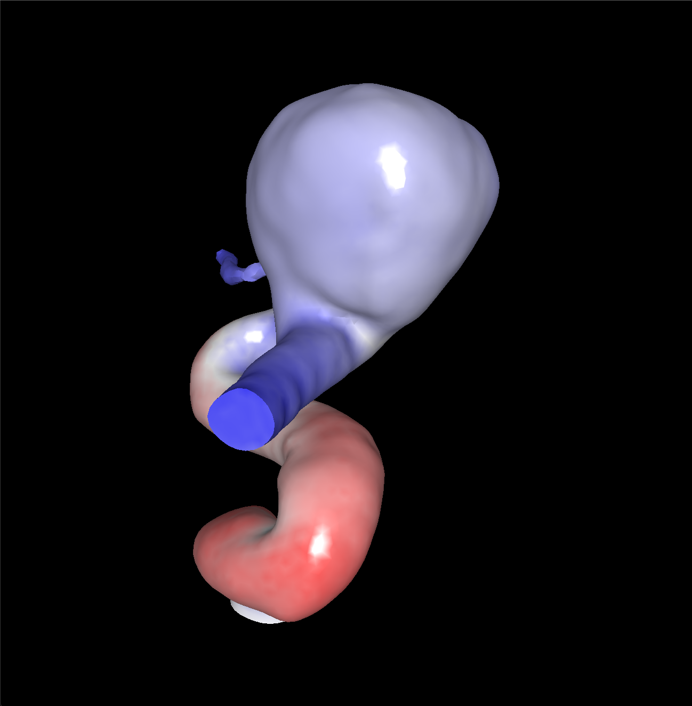
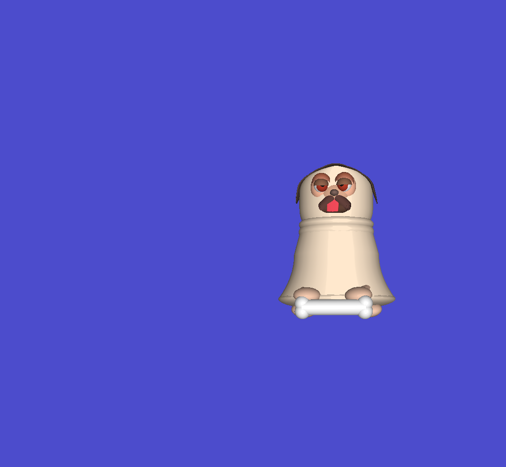

# CS541 - Intro to Computer Graphics

## Overview

## Project 1

Project 1 is the basics: implementing the scanline algorithm, color interpolation, z-buffer, and 3D transformations.
It was previously set up with VTK, but that became a challenge over time so now we're writing things from scratch.

**Project 1-A:** PNM writer and a sample image

**Project 1-B:** Implement a limited rasterizer able to plot upward triangles 
(two vertices have an identical y value, and the third has a higher y value.)

**Project 1-C:** Extend 1-B to support arbitrary triangles.

**Project 1-D:** Implement color interpolation and z-buffer to support depth.

**Project 1-E:** Implement a Camera class and calculate transformations.

**Project 1-F:** Implement shading and generate a video.

[Link to video](https://ix.cs.uoregon.edu/~alih/proj1F.mp4)

## Project 2
Start using OpenGL.

**Project 2-A:** Re-implement 1-F using OpenGL.

**Project 2-B:** Build a dog with spheres and cylinders.

## Project G

Project G is one where graduate students contribute a project to the class that the undergraduates can pick and complete for
their final project. 
Of course, I picked CUDA, always fun.

[projG](projG/README.md) holds my contributed prompt, starter code I provided, and the solution (what I reduced to get the
starter code.) Obviously I didn't write even a good naive rasterizer, but it was the best I could do in a reasonable amount of
time, and what would also be easy enough for the students to get done within 8-10 hours.

[projG-livecode](projG-livecode/README.md) is the live code I did in class when presenting.

My presentation (80 minute lecture) is in [presentation/](presentation/README.md).

## Credits
CS 441/541 (Winter 2023) was instructed by [Prof. Hank Childs](https://cdux.cs.uoregon.edu/childs.html).
So far one of my favorite courses in grad school!
