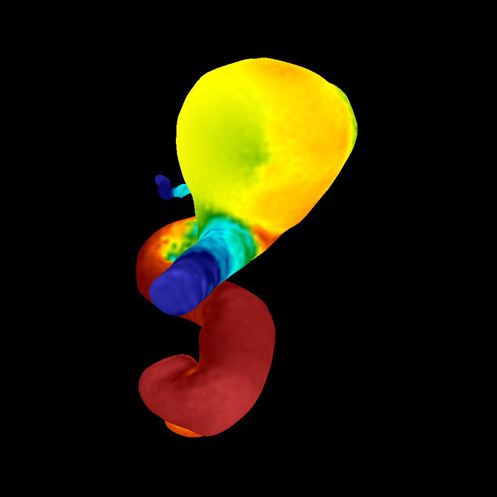

# CS541 - Intro to Computer Graphics

## Overview

## Project 1

Project 1 is the basics: implementing the scanline algorithm, color interpolation, z-buffer, and 3D transformations.
It was previously set up with VTK, but that became a challenge over time so now we're writing things from scratch.

* Project 1-A: PNM writer and a sample image

* Project 1-B: Implement a limited rasterizer able to plot upward triangles 
(two vertices have an identical y value, and the third has a higher y value.)

* Project 1-C: Extend the 1-B to support arbitrary triangles.

* Project 1-D: Implement color interpolation and z-buffer to support depth.

* Project 1-E: Implement a Camera class and calculate transformations.

* Project 1-F: Implement shading and generate a video.

[Link to video](http://ix.cs.uroregon.edu/~alih/proj1F.mp4)

## Credits
CS 441/541 (Winter 2023) was instructed by [Prof. Hank Childs](https://cdux.cs.uoregon.edu/childs.html).
So far one of my favorite courses in grad school!
