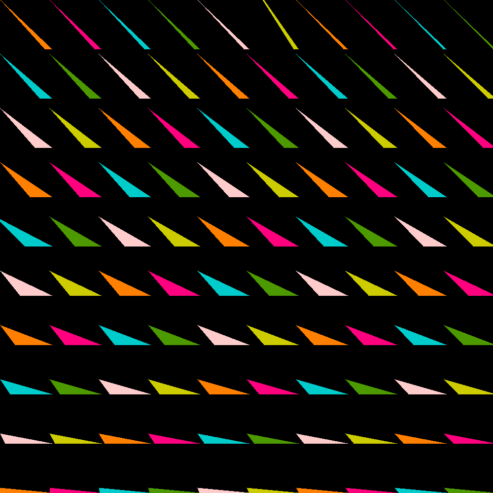

## Project 1-B

Implement a limited rasterizer able to plot upward triangles 
(two vertices have an identical y value, and the third has a higher y value.)

## Description
Implement the scanline algorithm for a set of 100 "going up" triangles and fill up the image buffer with their colors.
The image you make should be 1000x1000.
You should assume the "going up" triangles overlap with the pixels and apply the conventions discussed in Lecture 2 -- 
if a triangle overlaps with the lower left of a pixel, then the pixel should take its color.

## Solution

It looks a bit messy at this point, but I'll revise in future projects.
I implemented scanline for arbitrary triangles, and testing a dummy triangle --appears-- to have worked, but I'll know
if that was the case in 1C.

To generate my solution and run the checker script on it, just do `make`.

`make clean` will clean up compiled and output files.

For more info read `Makefile`.

## Output

## Credits
CS 441/541 (Winter 2023) was instructed by [Prof. Hank Childs](https://cdux.cs.uoregon.edu/childs.html).
