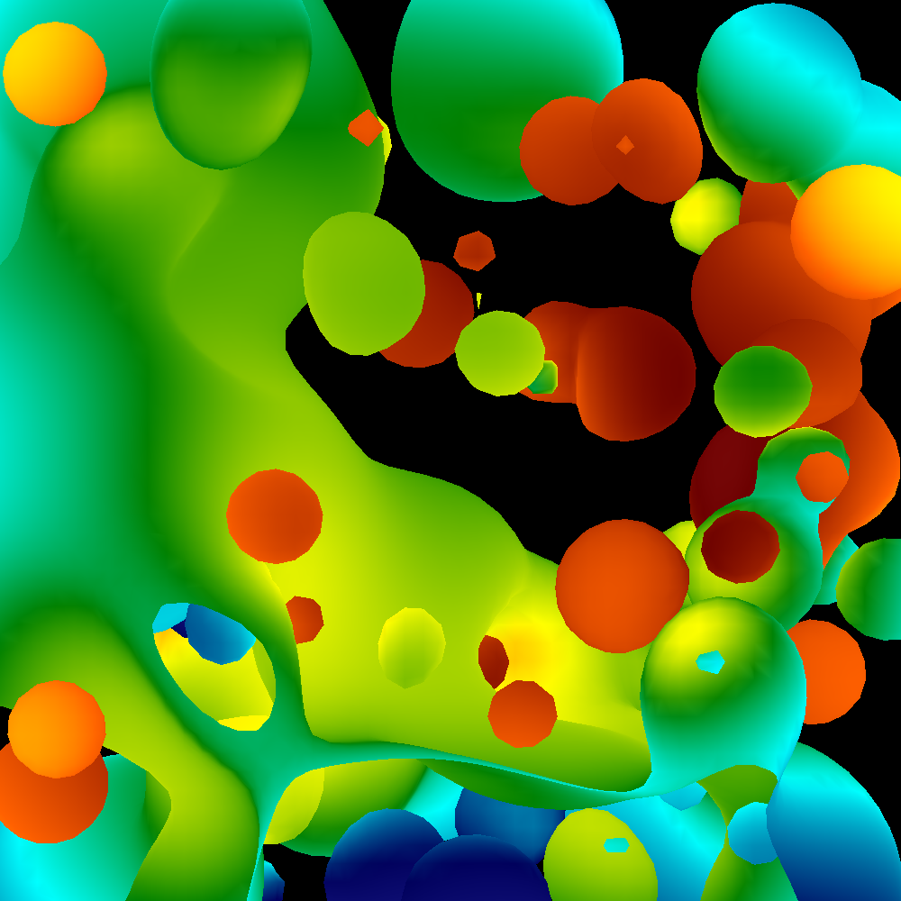

## Project 1-D
Implement color interpolation and z-buffer to support depth.

## Description

This project is in three phases:

1. adapt to reading data with z-values and per-vertex colors
2. implement Z-buffer algorithm
3. implement interpolation of colors

### Phase 1
Download the starter code and the new input file.
Update your code to use the new routine for reading data (Get3DTriangles) and incorporate the new struct for Triangles. 
(You don't need to copy mine.  But you need to add a 'z' field and you need to change your colors so you have 
per-vertex colors instead of per-triangle colors and also so these colors are doubles and not unsigned chars.)
The data file has a z-value for every triangle vertex and a color for every triangle vertex.

Modify your code so that it works with the new fields.  For Phase 1, this means:

* let Get3DTriangles read a Z value, but don't use it
* let Get3DTriangles read colors for each vertex.  You will use the color for vertex 0.  Read on.

In 1C, you set the color for each pixel to be the single color for the triangle.
In Phase 1, just use the color from vertex 0 -- the whole triangle will have one color in this phase, 
i.e., the color from vertex 0.
That said, note that colors have changed from unsigned chars to doubles with values between 0 and 1.
But images still need unsigned char data.  So, when assigning this color to your image data, do something like this:
```
 image.color[index].r = C441(r*255);
```
(I don't care whether the left-hand side of the equation looks like this example above. 
But you should do "C441" and multiply it by 255.)

Next, compile and run everything.
This phase is about making sure your code works with the new data members and nothing went catastrophically wrong.

### Phase 2
In this phase, you will implement the z-buffer algorithm.
This means you will need to do interpolation, i.e., interpolating the z field to each fragment in the triangle.

### Phase 3
In this phase, you will implement color interpolation, i.e., the correct color for every fragment.
The colors are stored as doubles.
You should keep them as doubles all the way until you store them in the image.
When you store them in the image, do it this way (same as Phase 1 -- multiply by 255 and then use C441).

## Solution

Added a third dimension to triangles, cleaned up a bit so now everything's divided into namespaces, and 
we have a dedicated lerp function. Didn't take much debugging to figure out the holes.

To generate my solution and run the checker script on it, just do `make`.

`make clean` will clean up compiled and output files.

For more info read `Makefile`.

## Output



## Credits
CS 441/541 (Winter 2023) was instructed by [Prof. Hank Childs](https://cdux.cs.uoregon.edu/childs.html).
