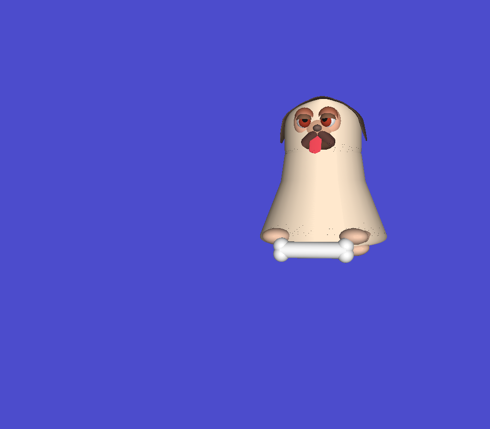
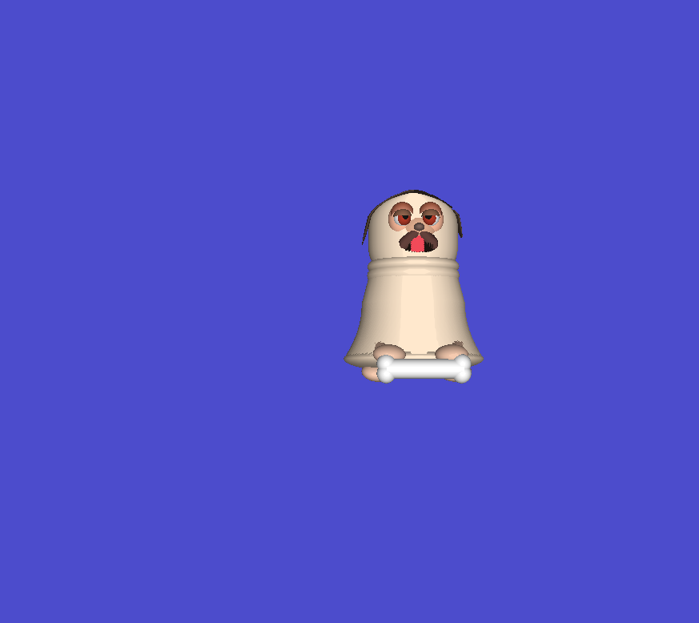

## Project 2-B
Make a dog out of spheres and cylinders.

## Output

## Journey
Oh, it was lotsa work.

### Shapes added
Hemispheres are used to make eyelids; pretty easy to make, just cut the sphere in half (literally change the for loop limit.)

Also added a cone shape; although it's not a cone, it's a cone cut in half. But it's useful in making arms and legs.

There's a `Disk` function that basically renders (almost) arbitrary shapes from disks (thin cylinders).
However, there will be a shading problem when that's used if you look at it from the opposite direction, which will happen
frequently.

So this is an earlier version with the shading problem (notice the black dots and lines):

and here it is without Phong shading:

And here's what I finally ended up with:

### Half cones instead of cylinders
After taking a break to attend to research for a few days, I figured I try a different strategy towards `Disk` and 
use my half cones instead, simply because it would give me a smoother transition.
Tried that, and it works! BUT I have to position the camera very carefully, otherwise it'll still look weird.

I guess I'll stop at this point.

### Go back to cylinders

Why am I so dumb? It was the view all along.
Went back to cylinders to do disks.

## Makefile
Just the usual, `make` will do everything for you (assuming you're on OSX with the dependencies from [2A](../proj2A/README.md)).
There's also `make twosided` to get two-sided shading... which doesn't look good.

## Credits
CS 441/541 (Winter 2023) was instructed by [Prof. Hank Childs](https://cdux.cs.uoregon.edu/childs.html).
