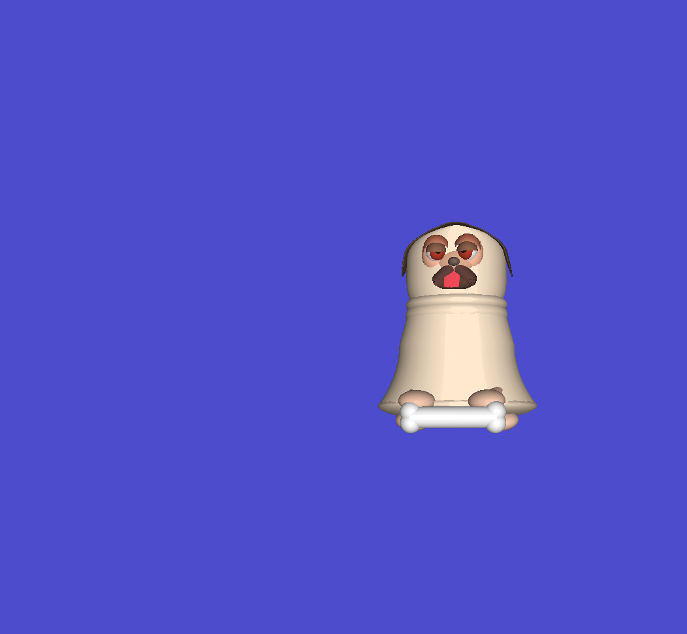

## Project 2-B
Make a dog out of spheres and cylinders.

## Output

## Journey
Oh, it was lotsa work.

### Shapes added
Hemispheres are used to make eyelids; pretty easy to make, just cut the sphere in half (literally change the for loop limit.)

Also added a cone shape; although it's not a cone, it's a cone cut in half. But it's useful in making arms and legs.

There's a `Shape1` that basically makes shapes from "disks" (thin cylinders).
However, there will be a shading problem when that's used if you look at it from the opposite direction, which will happen
frequently.

So this is an earlier version with the shading problem (notice the black dots and lines):

and here it is without Phong shading:

## Credits
CS 441/541 (Winter 2023) was instructed by [Prof. Hank Childs](https://cdux.cs.uoregon.edu/childs.html).
